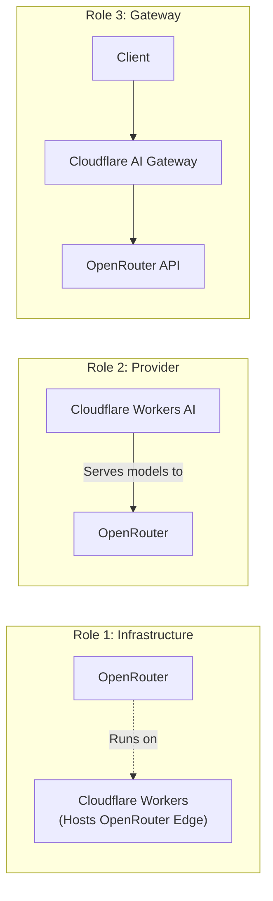
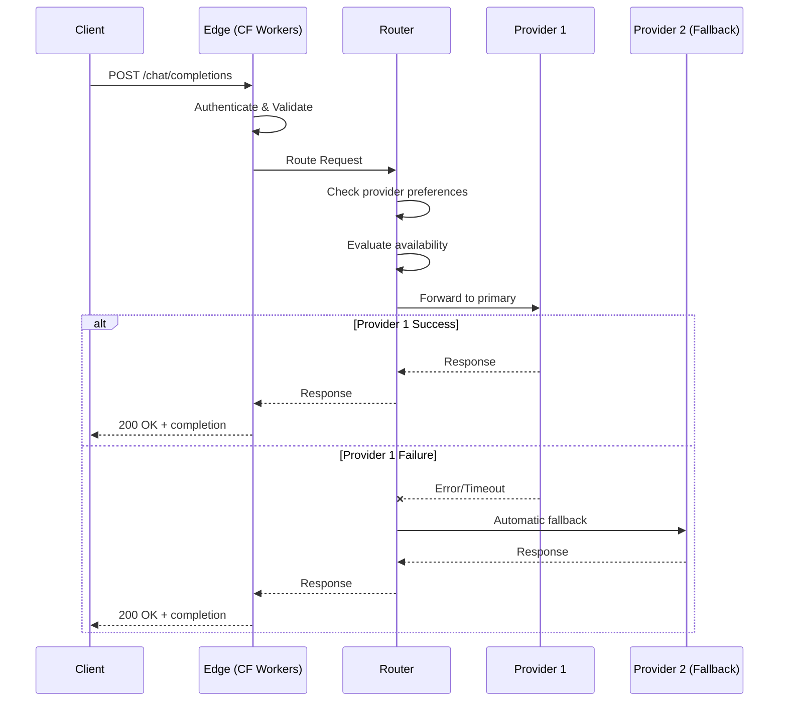

# OpenRouter Architecture

## Overview

OpenRouter provides a unified API gateway for accessing multiple LLM providers with intelligent routing, automatic fallbacks, and edge-optimized performance.

---

## Architecture Diagram

See [architecture.mermaid](./architecture.mermaid) for the full diagram.


---

## Component Details

### Edge Layer (Cloudflare Workers)
- **Unified API Endpoint**: Single endpoint (`/api/v1/chat/completions`) compatible with OpenAI format
- **Global Edge Deployment**: Low-latency access via Cloudflare's global network
- **Authentication**: API key validation and usage tracking

### Routing Engine
- **Intelligent Router**: Selects optimal provider based on model, cost, and preferences
- **Load Balancer**: Distributes requests across available providers
- **Fallback Controller**: Automatic failover when providers are unavailable
- **Cost Optimizer**: Routes to cost-effective providers when specified

### Provider Selection Logic
| Factor | Description |
|--------|-------------|
| **Provider Preferences** | User-specified provider ordering via `provider.order` |
| **Performance Metrics** | Real-time latency and throughput monitoring |
| **Availability Monitor** | Health checks and uptime tracking |
| **Request Queue** | Manages concurrent request limits per provider |

### Fallback Behavior
```
Request → Primary Provider
           ↓ (failure)
        Secondary Provider
           ↓ (failure)  
        Tertiary Provider
           ↓ (all failed)
        Error Response
```

---

## Cloudflare Integration (Dual Role)



| Role | Description |
|------|-------------|
| **Infrastructure** | OpenRouter runs on Cloudflare Workers for edge performance |
| **Provider** | Cloudflare Workers AI serves models (Llama, Mistral) through OpenRouter |
| **Gateway** | Cloudflare AI Gateway can proxy requests to OpenRouter for caching/rate-limiting |

---

## Request Flow Sequence



---

## Key Architectural Principles

1. **Single Endpoint Abstraction**: One API, many providers
2. **Edge-First Performance**: Cloudflare Workers minimize latency globally  
3. **Automatic Resilience**: Built-in fallbacks without client changes
4. **Provider Agnostic**: Swap providers without code changes
5. **Cost Optimization**: Route by price when performance allows
